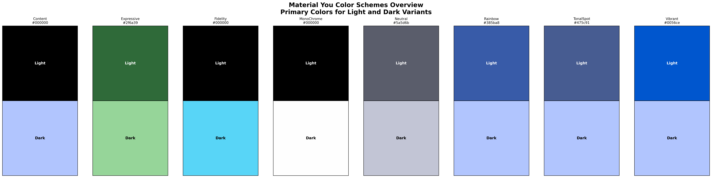

# Material Color Utilities in Lean4

Chinese: [README_ZH_CN.md](./README_ZH_CN.md)

# About this repository

This repository contains the google material color utilities rewritten in Lean4.

The qauntizer and score algorithms are implemented by Futhark.
Other algorithms are implemented by Lean4.

Since the original code is written in OOP style, the code here may not be very "leany".
I am trying to refactor the code to be more idiomatic Lean4 now.


# Build it from source
To Build the project from source, you need:
- lake
- Futhark
- ISPC (I use ISPC for the Futhark backend, but you can use other backends too)
- libpng and libjpeg-turbo (for image loading)
- make
- clang (I use clang for compiling the Futhark generated C code and LEAN_CC, but you can use other C compilers too)

Then, you can build the project by running:
```bash
make
```
or just run:
```bash
LEAN_CC=clang lake build
```

However, There are some tips you may want to know before building the project.
Since the C toolchain of Lean4 use old glibc, if your libpng and libjpeg-turbo
on your system are linked to your system glibc, you may get some errors.
So I recommend you to use clang or other C compilers for LEAN_CC instead of
using the default C toolchain of Lean4.

## Example Visualization

This project can extract colors from images and generate complete Material You color schemes. Below are visualizations generated from an example wallpaper:

### Extracted Colors
The system extracts 4 dominant colors from the example image:


### All Color Schemes Overview
Primary colors for light and dark variants of all generated schemes:


### Color Scheme Comparison
Comparison of key colors across all schemes (light variants):


### Individual Scheme Palettes
Complete color palettes for each scheme with light and dark variants:

| Scheme | Visualization |
|--------|--------------|
| Content |  |
| Expressive |  |
| Fidelity |  |
| MonoChrome |  |
| Neutral |  |
| Rainbow |  |
| TonalSpot |  |
| Vibrant |  |

### Interactive Preview
An HTML preview page with all visualizations is available at [`example/visualization/index.html`](example/visualization/index.html).

### Generating Visualizations
To generate similar visualizations for your own images:
1. Run the color extraction pipeline to generate a result file
2. Use the visualization script:
   ```bash
   cd example
   python generate_visualization.py
   ```
   The script requires Python with `matplotlib` and `numpy`. You can use `uv` to manage dependencies:
   ```bash
   uv venv .venv
   source .venv/bin/activate
   uv pip install matplotlib numpy
   ```
